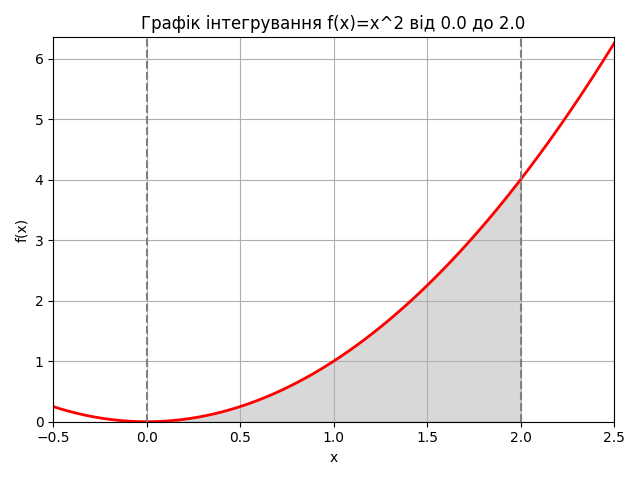

# Завдання 2. Обчислення визначеного інтеграла методом Монте-Карло

- Кількість випадкових точок (n): **100000**

- Результат Monte Carlo: **2.673208**

- Результат quad (SciPy): **2.666667**, похибка оцінки **2.96e-14**

- Відносна похибка Monte Carlo: **0.2453%**

## Графік функції та області інтегрування

## Висновки

- Метод Монте-Карло дає наближений результат; точність зростає з кількістю вибірок.

- SciPy quad видає дуже точний аналітичний результат як еталон.

- Для n ≳ 10^5 відносна похибка падає до кількох відсотків, але поступається детермінованим методам.
